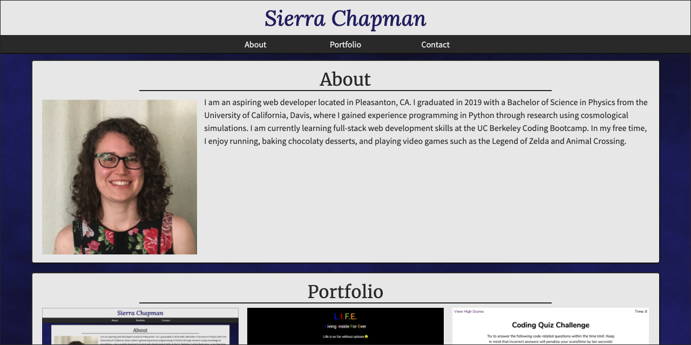

# Portfolio

This is my portfolio website, which displays my bio, selected projects, and contact information. The design is responsive and uses a combination of Bootstrap and custom CSS.

## Screenshot

Below is a screenshot of the deployed application.

## Built with

* [HTML](https://developer.mozilla.org/en-US/docs/Web/HTML)
* [CSS](https://developer.mozilla.org/en-US/docs/Web/CSS)
* [Bootstrap](https://getbootstrap.com/)
* [Google Fonts](https://fonts.google.com/)

## Deployed Link

* [See Live Site](https://sierrachapman.github.io/updated-portfolio/)

## Authors

* **Sierra Chapman** 
    - [Portfolio Site](https://sierrachapman.github.io/updated-portfolio/)
    - [Github](https://github.com/SierraChapman)
    - [LinkedIn](https://www.linkedin.com/in/sierra-chapman)

## Acknowledgments

* [WebAIM's contrast checker](https://webaim.org/resources/contrastchecker/) was a useful tool for ensuring sufficient text contrast.
* The background image was made with [GNU Image Manipulation Program](https://www.gimp.org/).